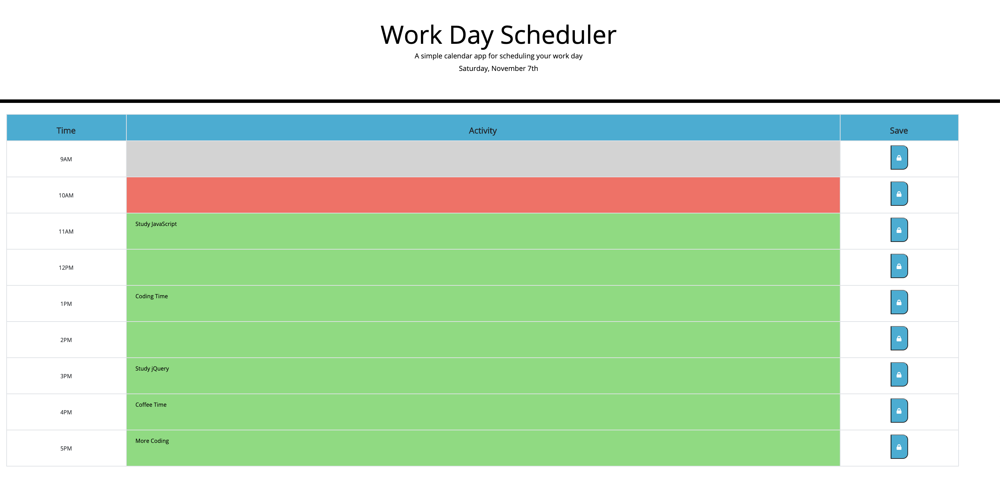

# Time Planner
This repository contains the solution for the homework assignment for unit 5 of UW Coding Bootcamp. It allows to save and view different daily tasks for each hour of the day from 9AM to 5PM.

# Task
The goal of the task was to develop a code to generate a daily timeplanner.
The starter code (partially .html, and .css) was provided. The starter files were needed to be updated, and the javascript developed from scratch. The expected functionoality of the Time Planner is described below: 

* Time Planner can be used for event scheduling
* Current Date should be displayed at the top of the page
* The planner has a table with timeblocks for standard business hours
* Each timeblock is color coded to indicate whether it is in the past (grey), present (red), or future (green)
* The user can type or re-type the event in the Activity column
* The event is saved in local storage upon click on Save button
* The saved events persist even after page is reload.

# URL to a live page
Link to a live page: https://kgo87.github.io/time_planner/

# Project Summary
The folder contains  *.html* and  *.css*, *.js* files and supplemental screenshots.

## HTML code
For the planner section, three-column table was used. Each column represented timeblock, event text area and savebutton.
For aesthetic purposes, header row was added to the table to show the names of the columns. The structure of the planner section is shown in the screenshot:

## JS code
* Display of the day at the top opf the page was accomplished using .moment() method
* To accomplish row coloring based on comparison of each time slot in the planner with the actual time, timeColoring function was developed

* On click event was developed to allow save user input in the text area of the Activity column 

* Local storage was used to store user's input and display when page is reloaded

# Finished product
Here are several screenshots showing the functionality of the developed time planner.
General view of the page:

As add-on functionality, the row on which the user hovers gets highlighted:

# Contact details
If you have any questions, contact me via email: 

